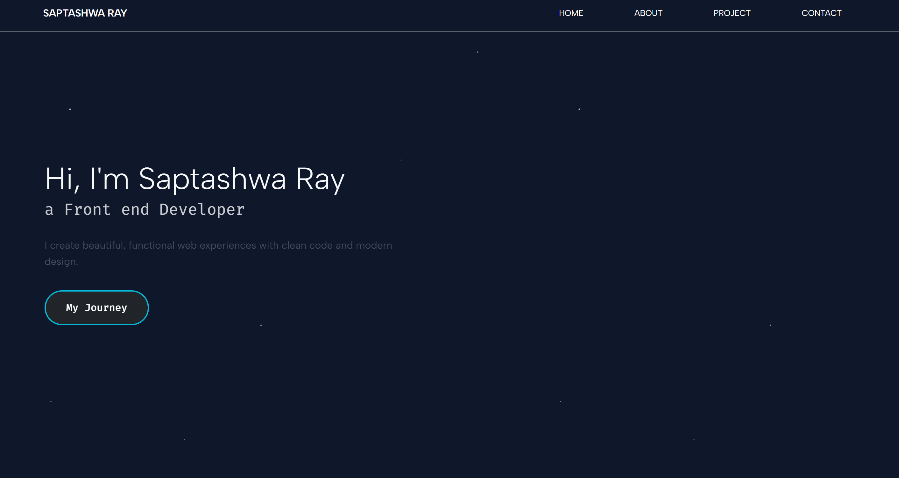

# Personal Portfolio Website

"Code. Design. Innovate." — A personal digital space showcasing the intersection of clean design and elegant frontend development.

This is the central hub for my professional digital identity. It is a fully responsive, semantic, and performant portfolio website designed to showcase my journey, projects, and skills as a developer. Built from the ground up, this site prioritizes user experience and clean aesthetics.

## 🌟 Key Features

The portfolio is structured into distinct, semantic sections to guide the visitor through my professional story:

- Responsive design
- Projects showcase
- About and skills section
- Contact section
- Clean UI

## 🛠️ Tech Stack & Philosophy
- HTML
- CSS
- JavaScript

## Purpose
This portfolio acts as a central place to showcase my work and GitHub projects as I grow as a developer.

🔗 Live Demo: https://portfolio-saptashwa-ray.netlify.app (netlify link)                                                                  

🔗 Live Demo: https://portfolio-saptashwa-ray.vercel.app (vercel link)

## Future Improvements
- A dedicated space for dev notes, technical tutorials, and project retrospectives.

## 👨‍💻 Author
Saptashwa Ray

Feel free to connect, collaborate, or provide feedback on the project!
